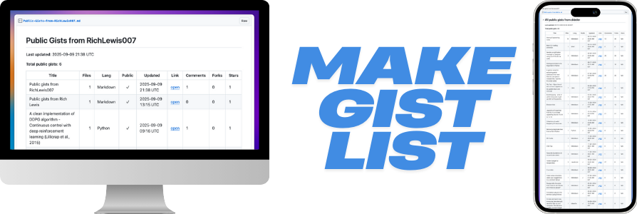

# Make Gist List 
Updated: 2025-11-03

<div align=center>
  


  [](https://github.com/RichLewis007/Make-Gist-List/actions/workflows/update-gist-list-agent.yml)
  [](https://www.python.org/downloads/)
  [](https://opensource.org/licenses/MIT)
  [](http://makeapullrequest.com) <!-- ALL-CONTRIBUTORS-BADGE:START - Do not remove or modify this section -->
  [](#contributors-)
  <!-- ALL-CONTRIBUTORS-BADGE:END -->

</div>

> **Automatically generate and maintain a markdown list of all your public GitHub gists**

A simple, lightweight Python script that fetches your public GitHub gists and creates an easy to read markdown table. Perfect for maintaining an up-to-date index of your code snippets, utilities, and examples.

##  Features

-  **Automatic Updates**: Runs daily via GitHub Actions
-  **Rich Information**: Title, file count, file names, language, public status, created date, update date, engagement metrics, and links, with full descriptions shown below each gist
-  **Optimized Performance**: Uses batched GraphQL queries for 26-40% fewer API calls
-  **Professional Logging**: Structured logging with configurable verbosity levels
-  **Gist Integration**: Updates a target gist with the generated list
-  **Easy Setup**: Fork, configure secrets, and you're done!
-  **Customizable**: Easy to modify output format and add new fields
-  **Secure**: Uses minimal GitHub token permissions (gist scope only)

##  Learning Resources

This project demonstrates several important programming concepts and optimization techniques:

- **[Optimization Techniques Guide](docs/OPTIMIZATION-TECHNIQUES.md)** - Learn about API optimization, GraphQL vs REST, batching strategies, and performance considerations
- **Code Examples** - See real-world implementations of error handling, type hints, and clean architecture
- **Best Practices** - Understand how to write maintainable, efficient code when working with external APIs

Perfect for developers looking to understand how to optimize API usage and write production-ready code!

##  Quick Start

### Option 1: Fork & Use (Recommended)

1. **Fork this repository** 
2. **Create a gist** to hold your list (copy its ID from the URL)
3. **Set up GitHub secrets** in your forked repo:
   - `LIST_GIST_ID`: The gist ID you created
   - `GIST_TOKEN`: A GitHub token with "gist" scope
   - *Note: `GITHUB_USERNAME` is automatically set to the repository owner*
4. **That's it!**  The workflow runs daily at 13:00 UTC

### Option 2: Run Locally

```bash
# 1. Clone the repository
git clone https://github.com/your-username/Make-Gist-List.git
cd Make-Gist-List

# 2. Create environment file from example
cp env.example .env

# 3. Edit .env file with your values
# GITHUB_USERNAME=your-username  # Required for local runs
# LIST_GIST_ID=your-gist-id      
# GIST_TOKEN=your-github-token   
# VERBOSE=1                      # Optional: enable debug logging
# TIMEZONE=America/New_York      # Optional: timezone for timestamps
# DATE_FORMAT=DD-MM-YYYY         # Optional: date format
# TIME_FORMAT=12                 # Optional: 12-hour time format
# USE_HTML_TABLE=true            # generate markdown or html format table

# 4. Install dependencies
uv sync

# 5. Run the script
uv run python make-gist-list.py

# Windows users: Use PowerShell or Command Prompt
# PowerShell: uv run python make-gist-list.py
# CMD: uv run python make-gist-list.py
```

>  **Tip**: The script automatically loads your `.env` file. For detailed local setup instructions, see the [Setup Guide](SETUP.md#local-command-line-usage).

###  Alternate Configuration Method

If you prefer not to use a `.env` file, you can configure the script using export variables:

**Export Variables**
```bash
# Linux/macOS
export GITHUB_USERNAME="your-username"
export TIMEZONE="America/New_York"
export DATE_FORMAT="MM-DD-YYYY"
export TIME_FORMAT="12"
export USE_HTML_TABLE="true"
uv run python make-gist-list.py

# Windows PowerShell
$env:GITHUB_USERNAME="your-username"
$env:TIMEZONE="America/New_York"
$env:DATE_FORMAT="MM-DD-YYYY"
$env:TIME_FORMAT="12"
$env:USE_HTML_TABLE="true"
uv run python make-gist-list.py
```

##  What You Get

The script generates a markdown table like this:

# Public Gists from your-username

**Last updated:** 2025-01-15 13:00 UTC

**Total public gists:** 42

<table>
<tr>
<th>Title</th><th>Files</th><th>File Names</th><th>Lang</th><th>Public</th><th>Created</th><th>Updated</th><th>Link</th><th>Comments</th><th>Forks</th><th>Stars</th>
</tr>
<tr><td>My awesome script</td><td>3</td><td>script.py, config.json, README.md</td><td>Python</td><td>✓</td><td>2024-01-10 09:15 EST</td><td>2024-01-15 12:30 EST</td><td><a href='https://gist.github.com/...'>open</a></td><td>2</td><td>1</td><td>5</td></tr>
<tr><td colspan='11'><strong>Description:</strong> A comprehensive script for data processing with configuration support and documentation</td></tr>
<tr><td>Quick utility</td><td>1</td><td>utils.js</td><td>JavaScript</td><td>✓</td><td>2024-01-14 14:00 EST</td><td>2024-01-14 15:20 EST</td><td><a href='https://gist.github.com/...'>open</a></td><td>0</td><td>0</td><td>3</td></tr>
<tr><td colspan='11'><strong>Description:</strong> Simple utility function for common tasks</td></tr>
</table>

List created by [Make Gist List](https://github.com/your-username/Make-Gist-List).

##  Configuration

### Environment Variables

| Variable | Required | Description |
|----------|----------|-------------|
| `GITHUB_USERNAME` |  | Your GitHub username |
| `LIST_GIST_ID` |  | ID of the gist to update |
| `GIST_TOKEN` |  | GitHub token with "gist" scope |
| `TARGET_MD_FILENAME` |  | Filename for the markdown in the gist (defaults to "Public-Gists.md") |
| `TIMEZONE` |  | Timezone for timestamp display (e.g., "UTC", "America/New_York", "Europe/London") |
| `DATE_FORMAT` |  | Date format ("YYYY-MM-DD", "DD-MM-YYYY", "MM-DD-YYYY") |
| `TIME_FORMAT` |  | Time format ("12" for 12-hour, "24" for 24-hour) |
| `USE_HTML_TABLE` |  | Output format ("true" for HTML tables, "false" for markdown tables) |

### Output Formats

The script supports two output formats:

**HTML Tables (`USE_HTML_TABLE=true`)** - Recommended for GitHub gists:
- Renders as actual tables in GitHub gists
- Supports full-width description rows using `colspan`
- Better for viewing in GitHub gist interface
-  **Note**: GitHub repository READMEs strip `colspan` attributes, so this format doesn't work there

**Markdown Tables (`USE_HTML_TABLE=false`)** - Recommended for repository README files:
- Standard markdown table syntax
- Renders properly in GitHub repositories, README files, etc.
- More portable across different markdown viewers
- Description appears in its own column (second position)

### GitHub Token Setup

1. Go to [GitHub Settings → Developer settings → Personal access tokens](https://github.com/settings/tokens)
2. Click "Generate new token (classic)"
3. Give it a name like "Gist List Updater"
4. Select the "gist" scope (this is the minimum required permission)
5. Copy the token and add it as `GIST_TOKEN` in your repository secrets

##  Customization

The script is designed to be easily customizable:

- **Change the markdown format**: Modify the `build_markdown()` function
- **Add more fields**: Extend the table structure in the markdown output
- **Change the schedule**: Update the cron in `.github/workflows/update-gist-list-agent.yml`
- **Add filtering**: Modify the `list_public_gists()` function to filter gists differently
- **Custom styling**: Modify the table headers, formatting, and layout

##  Documentation

- **[Setup Guide](SETUP.md)** - Detailed step-by-step setup instructions
- **[Environment Example](env.example)** - Example environment variable configuration
- **[Contributing Guidelines](CONTRIBUTING.md)** - How to contribute to this project

>  **Are you interested in how this open source program was crafted?**
> 
> Do you want to learn how the open source developers made this program efficient, how the code was organized and errors
> were logged and handled? Check out the included educational guide which goes into technical depth, discussing the 
> API optimization strategies used to pull data from potentially many gists from the back-end GitHub systems, the performance
> considerations and demonstrations of best practices in Python coding.
> 
> **Read [Optimization Techniques & Programming Concepts](docs/OPTIMIZATION-TECHNIQUES.md)**

##  Requirements

- **Python**: 3.10 or higher
- **Dependencies**: `requests` library
- **GitHub**: Account with public gists
- **Optional**: GitHub token with gist scope (for automatic updates)

##  Contributing

Contributions are welcome! Please see our [Contributing Guide](CONTRIBUTING.md) for details.

### Quick Contribution Ideas

- Add support for filtering gists by language or date
- Create alternative output formats (JSON, CSV, etc.)
- Add support for private gists (with proper authentication)

##  License

This project is licensed under the MIT License - see the [LICENSE](LICENSE) file for details.

##  Acknowledgments

- Built with the GitHub API
- Uses GitHub Actions for automation
- Inspired by the need for better gist organization

---

**⭐ If this project helps you, please give it a star!**

** Fork it to easily create your own gist list updater!**

##  Contributors

Thanks goes to these wonderful people ([emoji key](docs/emoji-key.md)):

<!-- ALL-CONTRIBUTORS-LIST:START - Do not remove or modify this section -->
<!-- prettier-ignore-start -->
<!-- markdownlint-disable -->
<table>
  <tbody>
    <tr>
      <td align="center" valign="top" width="14.28%"><a href="https://github.com/RichLewis007"><br /><sub><b>Rich Lewis</b></sub></a><br /><a href="https://github.com/RichLewis007/Make-Gist-List/commits?author=RichLewis007" title="Code"></a> <a href="#ideas-RichLewis007" title="Ideas, Planning, & Feedback"></a> <a href="#maintenance-RichLewis007" title="Maintenance"></a> <a href="#question-RichLewis007" title="Answering Questions"></a></td>
      <td align="center" valign="top" width="14.28%"><a href="https://dima-portfolio.vercel.app"><br /><sub><b>Joshua Dimaunahan</b></sub></a><br /><a href="#ideas-MindfulLearner" title="Ideas, Planning, & Feedback"></a> <a href="https://github.com/RichLewis007/Make-Gist-List/commits?author=MindfulLearner" title="Code"></a> <a href="https://github.com/RichLewis007/Make-Gist-List/issues?q=author%3AMindfulLearner" title="Bug reports"></a></td>
    </tr>
  </tbody>
</table>

<!-- markdownlint-restore -->
<!-- prettier-ignore-end -->

<!-- ALL-CONTRIBUTORS-LIST:END -->

This project follows the [all-contributors](https://github.com/all-contributors/all-contributors) specification. Contributions of any kind welcome!
