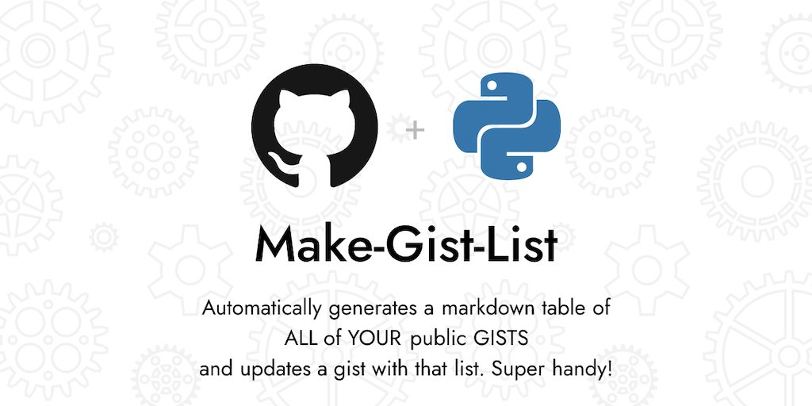

# Make Gist List 



<!-- ALL-CONTRIBUTORS-BADGE:START - Do not remove or modify this section -->
[](#contributors-)
<!-- ALL-CONTRIBUTORS-BADGE:END -->

[](https://github.com/RichLewis007/Make-Gist-List/actions/workflows/update-gist-list-agent.yml)
[](https://www.python.org/downloads/)
[](https://opensource.org/licenses/MIT)
[](http://makeapullrequest.com)

> **Automatically generate and maintain a markdown list of all your public GitHub gists**

A simple, lightweight Python script that fetches your public GitHub gists and creates an easy to read markdown table. Perfect for maintaining an up-to-date index of your code snippets, utilities, and examples.

##  Features

-  **Automatic Updates**: Runs daily via GitHub Actions
-  **Rich Information**: Title, file count, language, public status, update date, and links
-  **Gist Integration**: Optionally updates a target gist with the generated list
-  **Easy Setup**: Fork, configure secrets, and you're done!
-  **Customizable**: Easy to modify output format and add new fields
-  **Secure**: Uses minimal GitHub token permissions (gist scope only)

##  Quick Start

### Option 1: Fork & Use (Recommended)

1. **Fork this repository** 
2. **Create a gist** to hold your list (copy its ID from the URL)
3. **Set up GitHub secrets** in your forked repo:
   - `LIST_GIST_ID`: The gist ID you created
   - `GIST_TOKEN`: A GitHub token with "gist" scope
   - *Note: `GITHUB_USERNAME` is automatically set to the repository owner*
4. **That's it!**  The workflow runs daily at 13:00 UTC

### Option 2: Run Locally

```bash
# 1. Clone the repository
git clone https://github.com/your-username/Make-Gist-List.git
cd Make-Gist-List

# 2. Create environment file from example
cp env.example .env

# 3. Edit .env file with your values
# GITHUB_USERNAME=your-username  # Required for local runs
# LIST_GIST_ID=your-gist-id      # Optional
# GIST_TOKEN=your-github-token   # Optional

# 4. Install dependencies
pip install .

# 5. Run the script
python make-gist-list.py
```

>  **Tip**: For detailed local setup instructions, see the [Setup Guide](SETUP.md#local-command-line-usage).

##  What You Get

The script generates a markdown table like this:

```markdown
# Public Gists from your-username

**Last updated:** 2024-01-15 13:00 UTC

**Total public gists:** 42

| Title | Files | Lang | Public | Updated | Link |
|---|---:|---|:---:|---|---|
| My awesome script | 3 | Python |  | 2024-01-15 12:30 UTC | [open](https://gist.github.com/...) |
| Quick utility | 1 | JavaScript |  | 2024-01-14 15:20 UTC | [open](https://gist.github.com/...) |

_Generated by [Make Gist List](https://github.com/your-username/Make-Gist-List)._
```

##  Configuration

### Environment Variables

| Variable | Required | Description |
|----------|----------|-------------|
| `GITHUB_USERNAME` |  | Your GitHub username |
| `LIST_GIST_ID` |  | ID of the gist to update (optional) |
| `GIST_TOKEN` |  | GitHub token with "gist" scope (required if updating a gist) |
| `TARGET_MD_FILENAME` |  | Filename for the markdown in the gist (defaults to "Public-Gists.md") |

### GitHub Token Setup

1. Go to [GitHub Settings → Developer settings → Personal access tokens](https://github.com/settings/tokens)
2. Click "Generate new token (classic)"
3. Give it a name like "Gist List Updater"
4. Select the "gist" scope (this is the minimum required permission)
5. Copy the token and add it as `GIST_TOKEN` in your repository secrets

##  Customization

The script is designed to be easily customizable:

- **Change the markdown format**: Modify the `build_markdown()` function
- **Add more fields**: Extend the table structure in the markdown output
- **Change the schedule**: Update the cron in `.github/workflows/update-gist-list-agent.yml`
- **Add filtering**: Modify the `list_public_gists()` function to filter gists differently
- **Custom styling**: Modify the table headers, formatting, and layout

##  Documentation

- **[Setup Guide](SETUP.md)** - Detailed step-by-step setup instructions
- **[Environment Examples](env.example)** - Example environment variable configuration
- **[Contributing Guidelines](CONTRIBUTING.md)** - How to contribute to this project

##  Requirements

- **Python**: 3.10 or higher
- **Dependencies**: `requests` library
- **GitHub**: Account with public gists
- **Optional**: GitHub token with gist scope (for automatic updates)

##  Contributing

Contributions are welcome! Please see our [Contributing Guide](CONTRIBUTING.md) for details.

### Quick Contribution Ideas

- Add new fields to the gist table (stars, forks, etc.)
- Improve error handling and logging
- Add support for filtering gists by language or date
- Create alternative output formats (JSON, CSV, etc.)
- Add support for private gists (with proper authentication)

##  License

This project is licensed under the MIT License - see the [LICENSE](LICENSE) file for details.

##  Acknowledgments

- Built with the GitHub API
- Uses GitHub Actions for automation
- Inspired by the need for better gist organization

---

** If this project helps you, please give it a star!**

** Fork it to create your own gist list updater!**

##  Contributors

Thanks goes to these wonderful people ([emoji key](docs/emoji-key.md)):

<!-- ALL-CONTRIBUTORS-LIST:START - Do not remove or modify this section -->
<!-- prettier-ignore-start -->
<!-- markdownlint-disable -->
<table>
  <tbody>
    <tr>
      <td align="center" valign="top" width="14.28%"><a href="https://github.com/RichLewis007"><br /><sub><b>Rich Lewis</b></sub></a><br /><a href="https://github.com/RichLewis007/Make-Gist-List/commits?author=RichLewis007" title="Code"></a> <a href="#ideas-RichLewis007" title="Ideas, Planning, & Feedback"></a></td>
      <td align="center" valign="top" width="14.28%"><a href="https://dima-portfolio.vercel.app"><br /><sub><b>Joshua Dimaunahan</b></sub></a><br /><a href="#ideas-MindfulLearner" title="Ideas, Planning, & Feedback"></a></td>
    </tr>
  </tbody>
</table>

<!-- markdownlint-restore -->
<!-- prettier-ignore-end -->

<!-- ALL-CONTRIBUTORS-LIST:END -->

This project follows the [all-contributors](https://github.com/all-contributors/all-contributors) specification. Contributions of any kind welcome!
